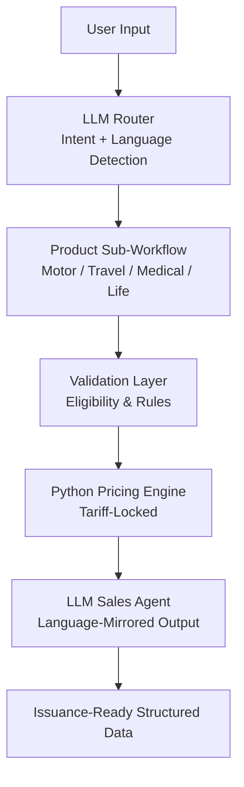

# AI-Driven Insurance Automation & Policy Issuance System

## Overview

This repository demonstrates the design of a deterministic AI automation platform for insurance quotation and policy issuance.

The system combines LLM orchestration, structured tariff modeling, and Python-based pricing engines to ensure accuracy, compliance, and scalability in regulated insurance domains.

A core design principle is the strict separation of AI reasoning and numerical calculation, making the system suitable for real-world insurance operations where auditability and deterministic behavior are required.

## Architecture

## Core Features

### LLM Orchestration
	•	Central routing logic for product detection and workflow selection
	•	Role-separated prompts (router, validator, sales agent)
	•	Deterministic instruction enforcement

### Tariff-Locked Pricing
	•	Normalized JSON tariff schemas
	•	Python functions handle all calculations and validations
	•	Zero pricing or benefit hallucination

### Compliance & Auditability
	•	Tariffs as the single source of truth
	•	Website vs tariff consistency audit logic
	•	Deterministic, reproducible outputs

### Multilingual Support
	•	English, Arabic, French, Arabizi
	•	Automatic language detection and response mirroring
	•	Insurance-domain terminology handling

### Scalable Workflow Design
	•	Modular sub-workflows (Economy, Deluxe, Premium, etc.)
	•	Easily extendable to new insurance products or markets

### Technologies
	•	Python (pricing engines and validation)
	•	JSON (tariff schema modeling)
	•	LLMs (routing, extraction, controlled generation)

•	Workflow orchestration (node-based automation)
	•	Prompt engineering for regulated environments

## Disclaimer

All company identifiers, tariffs, and proprietary data have been anonymized.
This repository focuses exclusively on architecture, logic, and engineering approach. 
